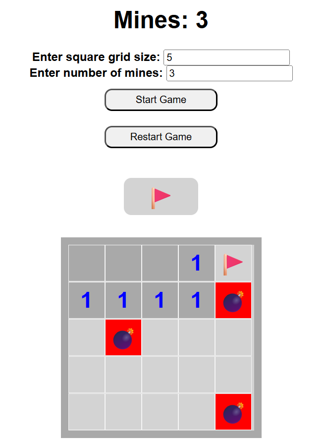

# Minesweeper 🎮

A simple web-based implementation of the classic **Minesweeper** game built with **HTML, CSS, and JavaScript**.  
Players can set the grid size and number of mines, then try to clear all safe tiles without triggering a mine.  

<p align="center">
  
</p> 

---

## 🚀 Features
- Adjustable **grid size** and **number of mines**.  
- **Left click** to reveal tiles.  
- **Flag button** 🚩 to mark suspected mines.  
- Win by clearing all safe tiles, lose if you hit a mine 💣.  
- **Bomb sound effect** when a mine is triggered.  
- Color-coded numbers for adjacent mines (1–8).  

---

## 📂 Project Structure
```
.
├── index2.html     # Main HTML file
├── style.css       # Game styling
├── app2.js         # Game logic
├── bomb.wav        # Explosion sound effect
└── README.md       # Documentation
```

---

## ⚙️ How to Run
1. Clone or download this repository.  
2. Open `index2.html` in your browser.  
3. Enter the **grid size** and **number of mines**, then click **Start Game**.  

---

## 🎮 Controls
- **Click a tile** → Reveal it.  
- **🚩 Flag button** → Toggle flag mode (mark/unmark tiles).  
- **Restart Game** → Start a new round with the same settings.  

---

## 🛠️ Technologies Used
- **HTML5**  
- **CSS3**  
- **Vanilla JavaScript**  

---

## 📌 Future Improvements
- Add difficulty presets (Easy, Medium, Hard).  
- Timer and high-score tracking.  
- Mobile-friendly controls.  
